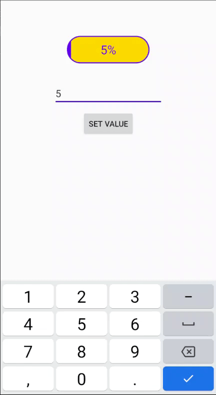

# BorderProgressButton


[](https://jitpack.io/#davistsin/BorderProgressButton)  

Support DataBinding, Border style, Progress animation, Android button.




## Dependency

```
allprojects {
    repositories {
        ...
        maven { url 'https://jitpack.io' }
    }
}

dependencies {
    implementation 'com.github.davistsin:BorderProgressButton:{latest version}'
}

```

## Guideline

```xml
<com.davistsin.widget.BorderProgressButton
    android:layout_marginTop="64dp"
    android:id="@+id/progress_button"
    android:layout_width="150dp"
    android:layout_height="50dp"
    app:bpbAnimationDuration="200"
    app:bpbBorderRadius="50dp"
    app:bpbBorderWidth="2dp"
    app:bpbProgress="@{viewModel.progress}"
    app:bpbText="@{viewModel.progressText}"
    app:bpbTextSize="22sp" />
```

attributes

| attr                  | unit   | description |
| ---                   | ---    | ---         |
| bpbProgress           | int    |             |
| bpbProgressColor      | HEX    |             |
| bpbMax                | int    |             |
| bpbText               | string |             |
| bpbTextColor          | HEX    |             |
| bpbTextCoverColor     | HEX    |             |
| bpbTextSize           | sp     |             |
| bpbBorderRadius       | dp     |             |
| bpbBorderColor        | HEX    |             |
| bpbBorderWidth        | dp     |             |
| bpbBackgroundColor    | HEX    |             |
| bpbAnimationDuration  | int    |             |

